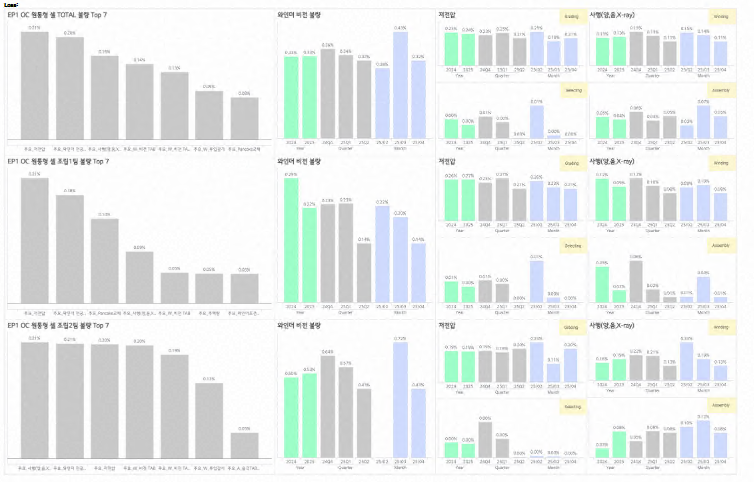

# KPI_Dashboard
Belows are some sample dashboards created in a process team to monitor Yield, Defect Rates and etc.
Example1: Dialy Defect Rate dashboard, providing which manufacturing line is facing high CEF defect rates.

Example2: Provide overall Yield Tracking Dashboard for decision-makers to monitor overal yield of manufacturing.

Example 3: Provide CTQ realted Defect Rates, highlighting which type of defects are dominating dailiy.

Example 4: Overall Yield tracking KPI performance of cell apperance related yield

